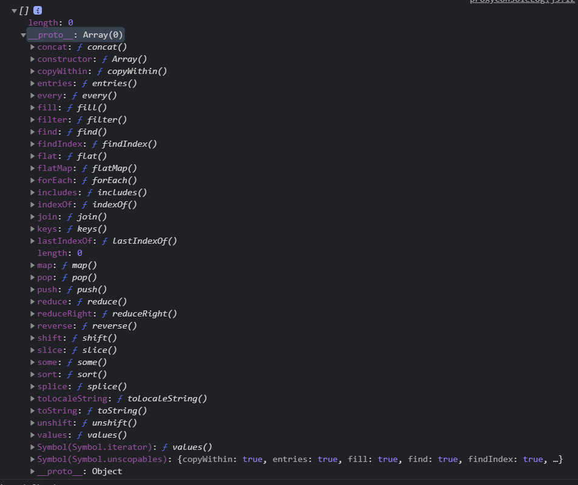
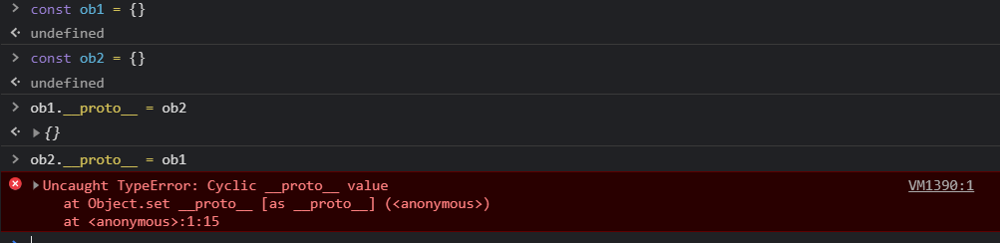

# Prototype-based Programming

- a style of OOP
- behavior reuse(inheritance)
- by reusing existing objects
- that serve as prototype

- 프로토타입을 이용해 기존의 오브젝트를 재사용 함으로써 상속을 가능하게 하는 객체지향의 한 방식이다.

## ko.javascript.info

### Prototype

자바스크립트의 객체는 `[[Prototype]]`이라는 "숨김 프로퍼티"를 갖습니다. 이 숨김 프로퍼티 값은 `null`이거나 다른 객체에 대한 참조가 되는데, 다른 객체를 참조하는 경우 참조하는 대상을 '프로토타입(Prototype)'이라 부릅니다.

```javascript
const a = Array() // a = []
console.log(a)
```



> a의 `__proto__`는 `Array`이다.
>
> `Array`의 `__proto__`는 `Object`이다.


원시 객체인 String은 어떻게 될까?

```js
const text = "a"
console.log(Object.getPrototypeOf(text)) // String
console.log(text.__proto__)	// String
console.log(text.__proto__.__proto__) // Object
console.log(text.__proto__.__proto__.__proto__) // null
```


> `__proto__`란?
>
> Prototype용 getter이자 setter 입니다.
> Prototype을 Get하거나 Set하기 위한 다른 방법으로는 `Object.getPrototypeOf()`, `Object.setPrototypeOf()`가 있습니다.


#### 프로토타입의 동작방식

Object에서 프로퍼티를 읽으려고 하지만, 읽으려고 하는 Object에 해당 프로퍼티가 없다면 Prototype에서 프로퍼티를 찾습니다.
이러한 동작 방식을 '프로토타입 상속'이라 부릅니다.

```js
let animal = { eats: true }
let rabbit = { jumps: true }

console.log(rabbit.eats) // undefined

rabbit.__proto__ = animal // rabbit의 프로토타입은 animal입니다 === rabbit은 animal을 상속받습니다
console.log(rabbit.eats) // true
```


```js
let animal = {
  eats: true,
  walk() {
    alert("동물이 걷습니다.");
  }
};

let rabbit = {
  jumps: true,
  __proto__: animal,	// rabbit은 animal을 상속받습니다.
};

let longEar = {
  earLength: 10,
  __proto__: rabbit,	// longEar는 rabbit을 상속받습니다.
};

// 메서드 walk는 프로토타입 체인을 통해 상속받았습니다.
longEar.walk();
// 1. longEar에는 walk가 없습니다, 프로토타입인 rabbit을 살펴봅니다.
// 2. rabbit에는 walk가 없습니다, 프로토타입인 animal을 살펴봅니다.
// 3. animal에는 walk가 있습니다.

alert(longEar.jumps);
// 1. longEar에는 jumps가 없습니다, 프로토타입인 rabbit을 살펴봅니다.
// 2. rabbit에 jumps가 있습니다.
```


##### 제약사항

1. 순환 참조는 허용되지 않습니다.

   

2. `__proto__`의 값은 객체나 null만 가능합니다.

##### this

프로토타입에서 상속받은 `method`라도 `obj.method()`를 호출하면 `method`안의 `this`는 호출 대상 객체인 `obj`를 가리킵니다.

```js
const animal = {
    isFull: false,
    eats() {
        this.isFull = true
    }
}

const rabbit = {
    jumps() {
		this.isFull = false
    },
   	__proto__: animal,
}

rabbit.eats()				// 토끼가 밥을 먹은거지, 동물이 먹은 게 아닙니다.
console.log(rabbit.isFull)	// true
console.log(animal.isFull)	// false

rabbit.jumps()
console.log(rabbit.isFull)	// false
console.log(animal.isFull)	// false

animal.eats()
console.log(rabbit.isFull)	// false
console.log(animal.isFull)	// true
```


### 문제

#### 왜 햄스터 두 마리의 배는 꽉 찰까요?

https://ko.javascript.info/prototype-inheritance#ref-35
